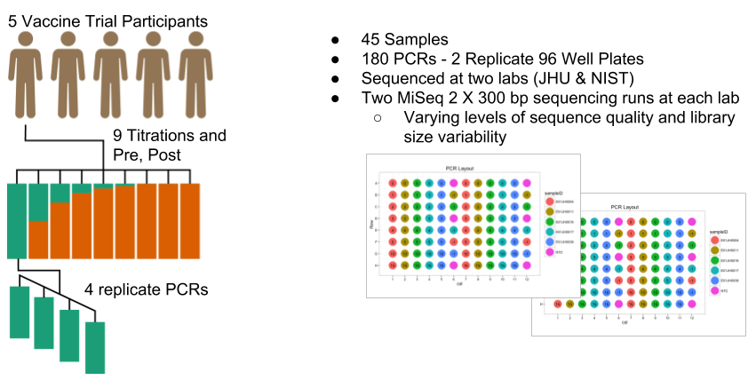

```{r include = FALSE}
# knitr::opts_chunk$set(warning = FALSE, message = FALSE, echo = FALSE, fig.path = "img/", out.width = "\\textwidth")
knitr::opts_chunk$set(warning = FALSE, message = FALSE, echo = FALSE, fig.path = "img/")
source("src/plot_color_definitions.R")
```

<!--
BMC Microbiome Submission https://microbiomejournal.biomedcentral.com/submission-guidelines/preparing-your-manuscript/methodology

Rmarkdown with BMC template https://stackoverflow.com/questions/44373540/no-author-details-in-pdf-from-r-markdown-latex-template
-->

# Abstract
```{r introduction, child="docs/abstract.Rmd"}
```

# Introduction
```{r introduction, child="docs/introduction.Rmd"}
```


# Methods
```{r methods, child="docs/methods.Rmd"}
```

# Results
```{r experimentalDesign, echo = FALSE, fig.cap = "Two-sample titration dataset experimental design. The dataset contained independent two-sample titration series from 5 vaccine trial participants (subjects), resulting in 45 samples. PCRs were run on two 96 well plates with each plate half containing one for each sample and three no template control reactions. The four replicate PCR assays per sample resulted in 180 PCRs. The PCR products were split into technical replicates and sequenced twice at two different laboratories."}

```

We sequenced the bacterial communities in stool samples collected from five vaccine trial participants before and after exposure to pathogenic _E. coli_ (Fig. \@ref(fig:experimentalDesign)).  Mixture samples were generated by titrating pre- and post- exposure samples at different concentrations.  Each sample was sequenced twice at two different laboratories (JHU and NIST) for a total of four runs.

## Dataset Characteristics

```{r seqPipeChar, child="reports/seq_and_pipe_characterization.Rmd"}
```

```{r sampleChar, child="reports/sample_characterization.Rmd", eval = FALSE}
## Excluding for now, not sure how it fits into the narrative
```

## PCR Repeatability
```{r techArt, child="reports/tech_artifacts.Rmd"}
```


## Signal to Noise

```{r compToExp, child="reports/signal_to_noise.Rmd"}
```


## Biological v. Technical Variation

```{r bioVtech, child="reports/biological_v_technical.Rmd"}
```


# Discussion
```{r discussion, child="docs/discussion.Rmd", warning=FALSE, message=FALSE, echo = FALSE}
```

# References
<!-- <div id="refs"></div> -->
